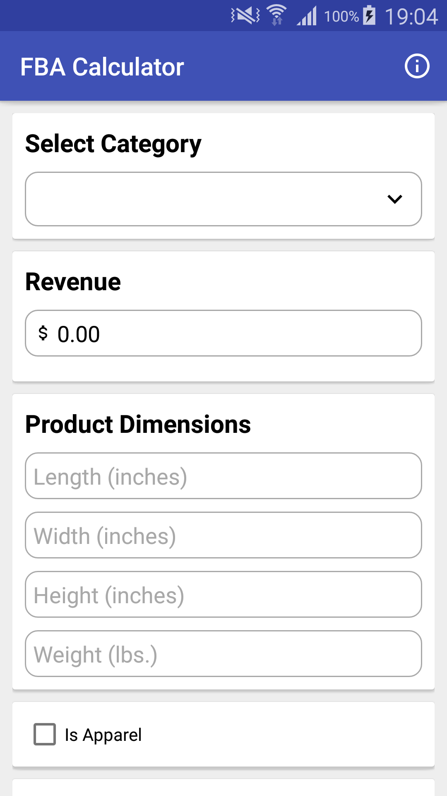
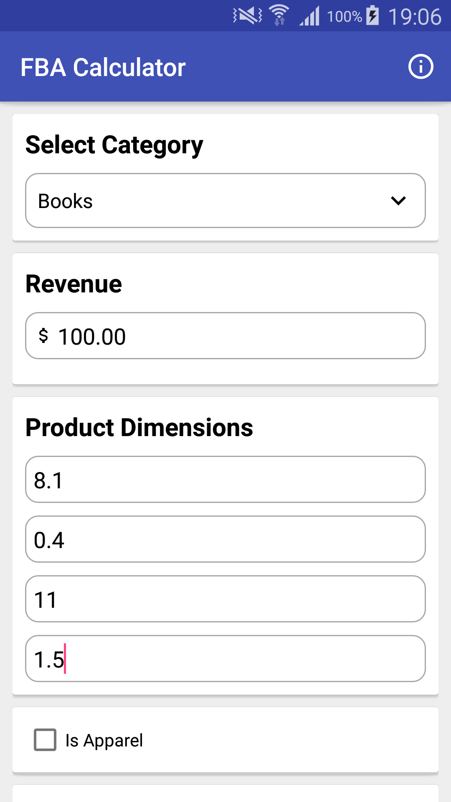
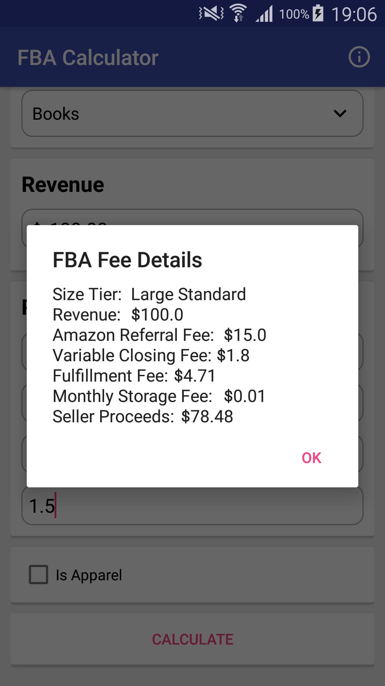

# FBA Calculator
Calculate the `Seller proceeds` and know your `FBA fee` such as `Amazon Referral Fee`, `Variable Closing Fee`, `Fulfillment Fee` and `Monthly Storage Fee`.

# Screenshots




## 1. What is FBA and FBA calculator?
Full form of FBA is Fulfilled by Amazon. With Fulfillment by Amazon (FBA), you
store your products in Amazon's fulfillment centers, and they pick, pack, ship, and provide
customer service for your products. Best of all, FBA can help you scale your business and reach
more customers.

FBA calculator is used to calculate how much fees you have to pay Amazon for FBA Purpose.

## 2. Revenue, Item Price, and shipping
Item Price is the Price charged to the customer.
Shipping is the Price charged to the customer for shipping. For seller-fulfilled orders,
the seller collects this amount as revenue. For FBA orders, shipping amount is zero as this is
already included in Item Price.

Revenue is the sum of Total Price and Shipping Price.

## 3.Size Tier, Product Dimensions, Fulfillment Fee, and Monthly Storage Fee
Size Tier tells in which category the Item falls. Either it is Standard-Size or Oversize.
Size Tier is computed based on the product dimensions (Length, Width, Height, and Weight).

Based on the Size Tier Fulfillment fee and Monthly Storage fee is calculated.

For more information you can visit this link
https://services.amazon.com/fulfillment-by-amazon/pricing.html

## 4. Amazon Referral Fee and Variable Closing Fee
Amazon Referral Fee: Sellers pay a referral fee on each unit sold. This fee depends on the category the product
belongs to and is calculated using a percentage of each unit's total price. Products in certain
categories have a per-item minimum referral fee.

Variable Closing Fee is charged for each Media item that is sold. All sellers pay a Variable Closing Fee.

For more information you can visit the below link
https://sellercentral.amazon.com/gp/help/external/200336920?language=en_US

##### Source of information: Amazon.com

# Usage
Get the `FBA.Builder` Instance:
```
FBA.Builder builder = new FBA.Builder();
```
set the values of product
```
// set product category
builder.setCategory("Books");

// set the total item price
builder.setPrice(100.0);

// set dimensions
builder.setLength(8.1); // in inches
builder.setWidth(0.4); // in inches
builder.setHeight(11); // in inches

// set the weight
builder.setWeight(1.5); // in pounds

// is the product apparel or not
builder.setApparel(false);

// calculate the fees
FBAFee fee = builder.calculate();
```

**FBAFee** class has all the details of the fees.

```
// get the size tier
fee.getSizeTier();

// get the Revenue
fee.getRevenue();

// get the referral fee
fee.getAmazonReferralFee();

// get the variable closing fee
fee.getVariableClosingFee();

// get the fulfillment fee
fee.getFulfillmentFee();

// get monthly storage fee
fee.getMonthlyStorageFee();

// get seller proceeds
fee.getSellerProceeds();
```

# License

    Copyright (c) 2018, Deepak Goyal under Apache License. 
    All rights reserved.
    Redistribution and use in source and binary forms, with or without
    modification, are permitted provided that the following conditions are met:
    
    - Redistributions of source code must retain the above copyright
      notice, this list of conditions and the following disclaimer.
    
    - Redistributions in binary form must reproduce the above copyright
      notice, this list of conditions and the following disclaimer in the
      documentation and/or other materials provided with the distribution.